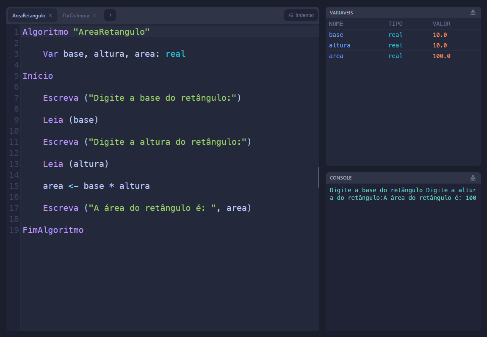
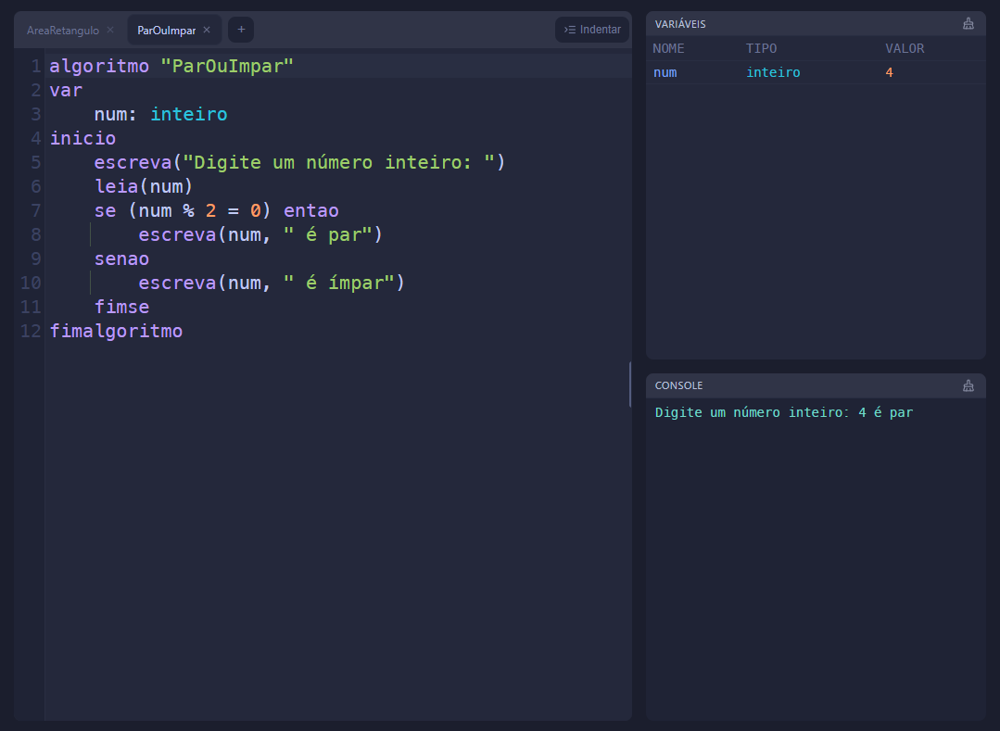
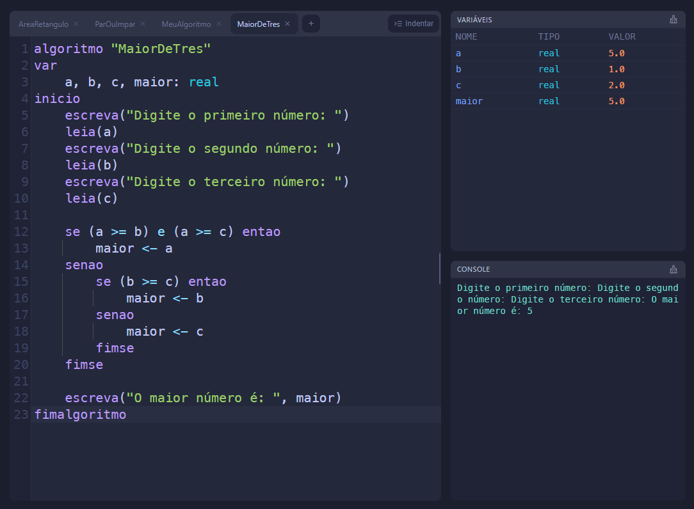

# Exercícios — Módulo 2: Lógica, algoritmos e fluxogramas

- **Aluno:** Jackson Miranda
- **Aula:** 2 · 14/07
- **Curso:** Jornada DEV START — Programa START (TOTVS Paulista)
- **Prazo sugerido:** até a Aula 3 (15/07)
- **Onde entregar:** atividade do Módulo 2 no Google Classroom

---

## Exercício 2 — Pseudocódigo

Escreva em pseudocódigo um algoritmo para cada item:

 - a. Calcular a área de um retângulo (base × altura)
 - b. Verificar se um número é par ou ímpar
 - c. Encontrar o maior entre três números

Dica: use as palavras Leia , Escreva , Se ... Senão e o operador ← para atribuir.

---
 - ### a. Calcular a área de um retângulo (base × altura)

## Algoritmo "AreaRetangulo"

    Var base, altura, area: real
    Início
        Escreva ("Digite a base do retângulo:")
        Leia (base)
        Escreva ("Digite a altura do retângulo:")
        Leia (altura)
        area <- base * altura
        Escreva ("A área do retângulo é: ", area)
    FimAlgoritmo

---
 - ### b. Verificar se um número é par ou ímpar

## Algoritmo "ParOuImpar"

    var
        num: inteiro
    inicio
        escreva("Digite um número inteiro: ")
        leia(num)
        se (num % 2 = 0) entao
            escreva(num, " é par")
        senao
            escreva(num, " é ímpar")
        fimse
    fimalgoritmo

---

- ### c. Encontrar o maior entre três números

## Algoritmo "Maior de Três"

    var
        a, b, c, maior: real
    inicio
        escreva("Digite o primeiro número: ")
        leia(a)
        escreva("Digite o segundo número: ")
        leia(b)
        escreva("Digite o terceiro número: ")
        leia(c)

        se (a >= b) e (a >= c) entao
            maior <- a
        senao
            se (b >= c) entao
                maior <- b
            senao
                maior <- c
            fimse
        fimse

        escreva("O maior número é: ", maior)
    fimalgoritmo