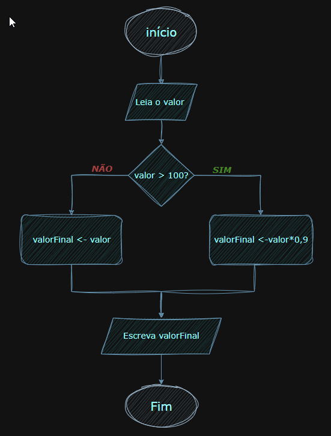

# Exercícios — Módulo 2: Lógica, algoritmos e fluxogramas

- **Aluno:** Jackson Miranda
- **Aula:** 2 · 14/07
- **Curso:** Jornada DEV START — Programa START (TOTVS Paulista)
- **Prazo sugerido:** até a Aula 3 (15/07)
- **Onde entregar:** atividade do Módulo 2 no Google Classroom
  
-------

## Exercício 3 — Fluxograma

Monte um fluxograma para o seguinte problema:

    “Uma loja dá desconto de 10% para compras acima de R$ 100. Leia o valor da compra e
    mostre o valor final a pagar.”

Dica: use o losango para a decisão ( Valor > 100? ) com os dois caminhos Sim e Não.

-----------

 - ### Fluxograma de Desconto

