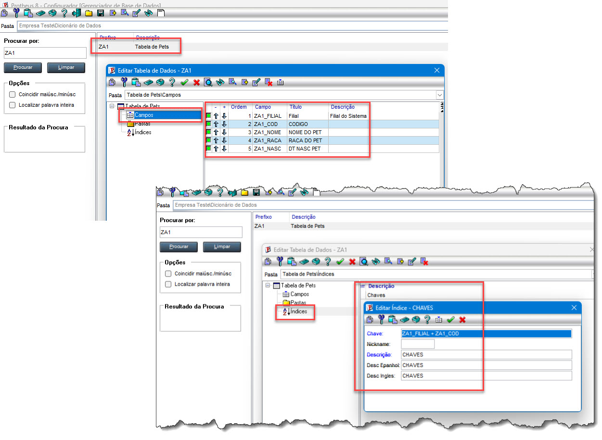
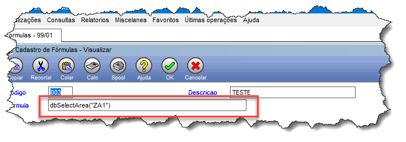
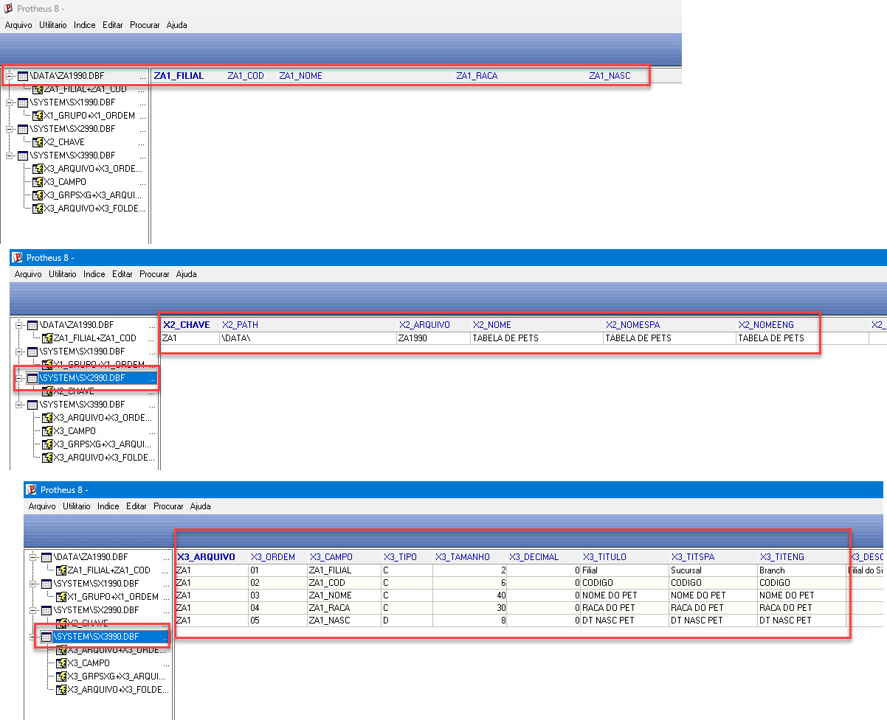

# Exercício 3 — Recriando a ZA1 no Configurador

A)- Cadastrar a estrutura no dicionário (SX2/SX3)  

B)- Forçar o reconhecimento da tabela pelo framework

C)- Conferir a estrutura final no MPSDU

  
 

Resumo do fluxo

SIGACFG → SX2 (tabela) → SX3 (campos) → SIX (índice) → rotina de reconhecimento → MPSDU (validação)

