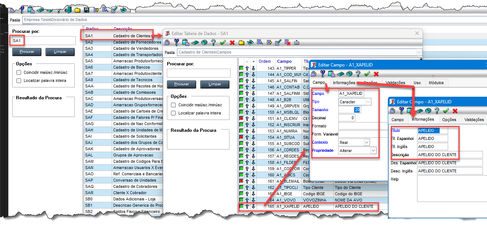
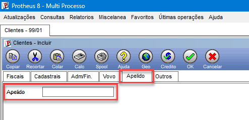

# Exercício 4 — Campo customizado na SA1

A)- Definir tipo, tamanho e título no Configurador

B)- Mostrar o campo no SmartClient (sem escrever código)

 Resumo do fluxo 

 SIGACFG → SX3 (novo campo A1_XAPELID) → salvar → SmartClient → campo aparece 
