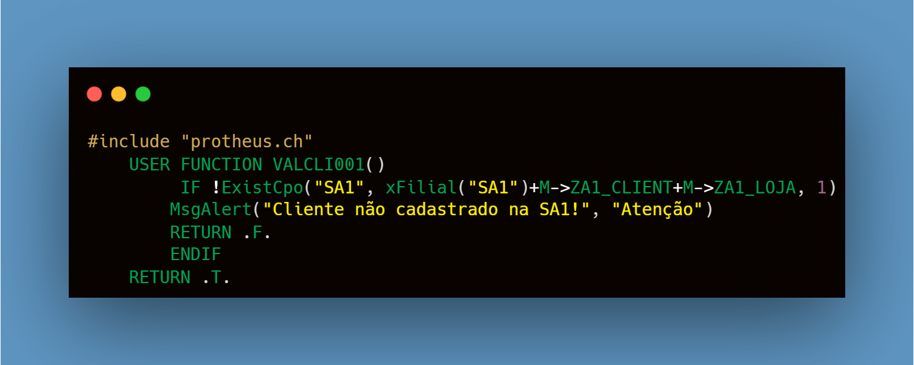
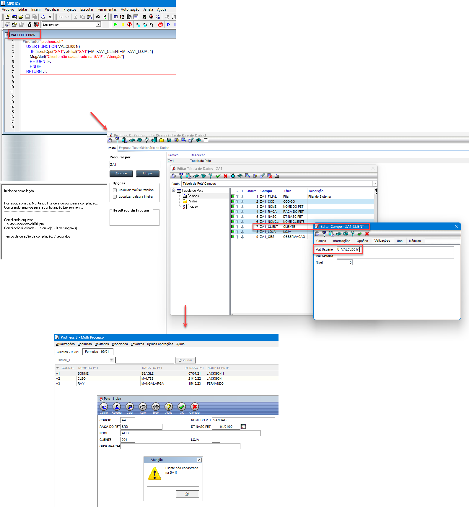

## <u> CÓDIGO: </u>

###  - Para copiar e colar: 
⬇️ ⬇️ ⬇️ ⬇️ ⬇️ ⬇️ ⬇️

```#include "protheus.ch"
	USER FUNCTION VALCLI001()
  		 IF !ExistCpo("SA1", xFilial("SA1")+M->ZA1_CLIENT+M->ZA1_LOJA, 1)
 		MsgAlert("Cliente não cadastrado na SA1!", "Atenção")
 		RETURN .F.
 		ENDIF
	RETURN .T.
```

###  - Imagem do Código:




###  -  Print da mensagem aparecendo ao digitar um cliente inexistente:


