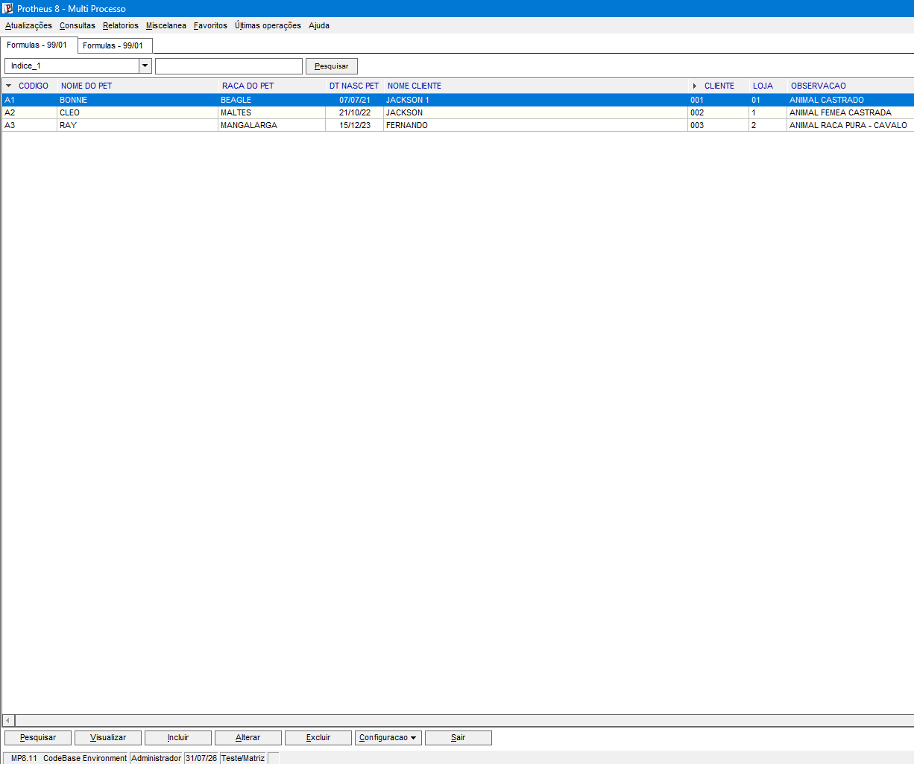
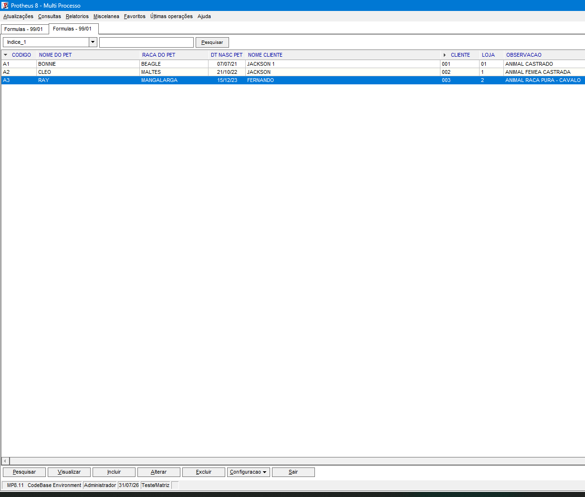

## Comparação:  
Visualmente, as rotinas ficaram semelhantes porque ambas utilizam a mesma tabela ZA1, os mesmos campos do dicionário SX3 e as mesmas operações de cadastro. A principal diferença está na implementação. No Exercício 3, o ***AxCadastro()*** cria automaticamente o browse e as operações padrão. No Exercício 5, o ***mBrowse()*** exige a criação manual do aRotina, a seleção do alias, a definição da ordem e das coordenadas da grade. Portanto, o AxCadastro() é mais simples e automático, enquanto o mBrowse() permite maior controle sobre a montagem da tela.


## <u> CÓDIGO:</u>
###  - Para copiar e colar:
 
⬇️ <span style="font-size: 1.2em; color:rgba(255, 230, 10, 0.99); font-style: italic">AxCadastro</span> ⬇️

```
#include "protheus.ch"

USER FUNCTION STTIP001()
	PRIVATE cCadastro := "Pets"
	dbSelectArea("ZA1")
	dbSetOrder(1)
	AxCadastro("ZA1", "Pets")
RETURN NIL
```




## <u> CÓDIGO:</u>
###  - Para copiar e colar:
 
⬇️ <span style="font-size: 1.2em; color:rgba(255, 230, 10, 0.99); font-style: italic">mBrowse</span> ⬇️

```
#include "protheus.ch"
	USER FUNCTION STTIP002() 
	Private cCadastro := "Cadastro de Pets"
 	Private aRotina   := {}
 	
    AAdd(aRotina, {"Pesquisar" , "AxPesqui", 0, 1})
    AAdd(aRotina, {"Visualizar", "AxVisual", 0, 2})
    AAdd(aRotina, {"Incluir"   , "AxInclui", 0, 3})
    AAdd(aRotina, {"Alterar"   , "AxAltera", 0, 4})
    AAdd(aRotina, {"Excluir"   , "AxDeleta", 0, 5})

    dbSelectArea("ZA1")
    dbSetOrder(1)

    mBrowse(6, 1, 22, 75, "ZA1")

Return NIL
```


