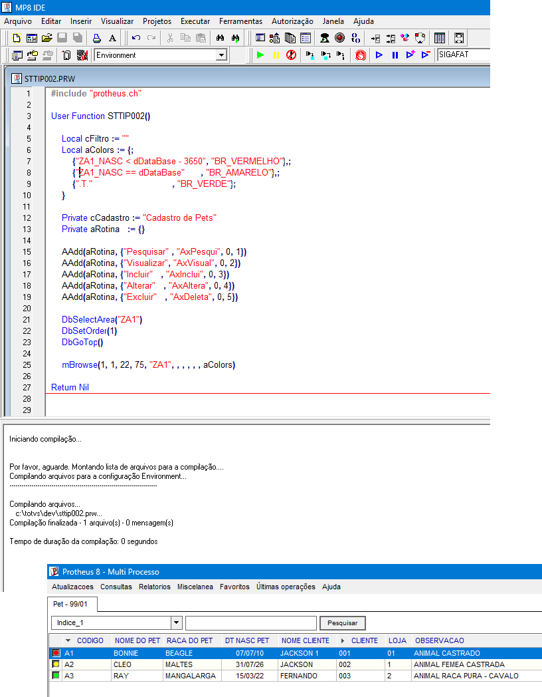

## <u> CÓDIGO:</u>
###  - Para copiar e colar:
 
⬇️ <span style="font-size: 1.2em; color:rgba(255, 230, 10, 0.99); font-style: italic">STTIP002</span> ⬇️

```
#include "protheus.ch"

User Function STTIP002()

    Local cFiltro := ""
    Local aColors := {;
        {"ZA1_NASC < dDataBase - 3650", "BR_VERMELHO"},;
        {"ZA1_NASC == dDataBase"      , "BR_AMARELO"},;
        {".T."                              , "BR_VERDE"};
    }

    Private cCadastro := "Cadastro de Pets"
    Private aRotina   := {}

    AAdd(aRotina, {"Pesquisar" , "AxPesqui", 0, 1})
    AAdd(aRotina, {"Visualizar", "AxVisual", 0, 2})
    AAdd(aRotina, {"Incluir"   , "AxInclui", 0, 3})
    AAdd(aRotina, {"Alterar"   , "AxAltera", 0, 4})
    AAdd(aRotina, {"Excluir"   , "AxDeleta", 0, 5})

    DbSelectArea("ZA1")
    DbSetOrder(1)
    DbGoTop()

    mBrowse(1, 1, 22, 75, "ZA1", , , , , , aColors)

Return Nil

```

## <u> Evidências:</u>

